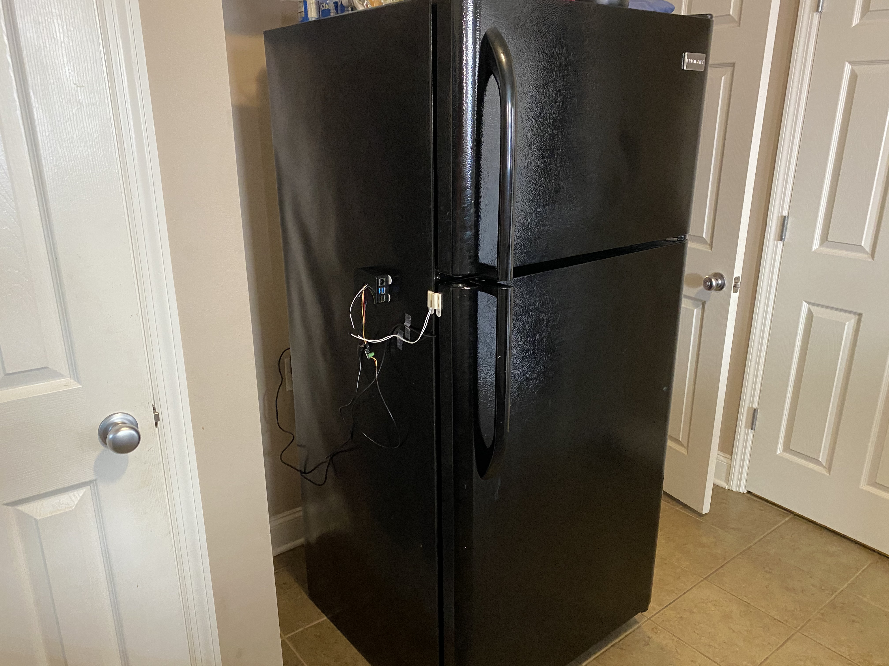
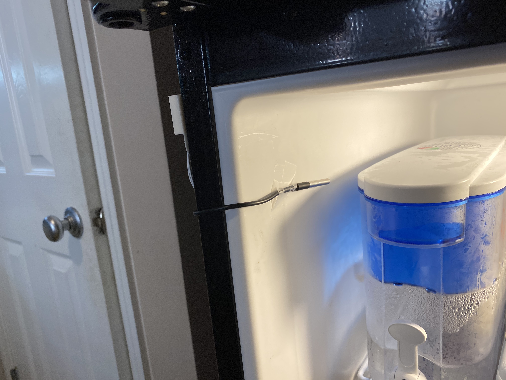
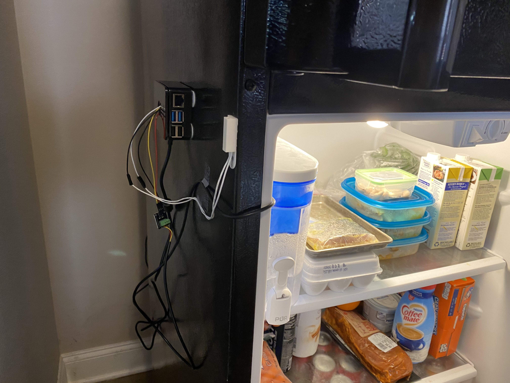

# _Did You Leave Your Refrigerator Running?_ Software Manual<br/>

### Daniel Rockwell | April 24, 2020

## <ins>Hardware Needed</ins>

Here is a list of hardware used to create this application:

- CanaKit Raspberry Pi 4 4GB Starter Kit - 4GB RAM | [Click here to view on Amazon](https://www.amazon.com/CanaKit-Raspberry-4GB-Starter-Kit/dp/B07V5JTMV9)
- DS18B20 Temperature Sensor Module Kit Waterproof 100CM Digital Sensor Cable Stainless Steel Probe Terminal Adapter for Arduino | [Click here to view on Amazon](https://www.amazon.com/gp/product/B07T6JHK5M/ref=ppx_yo_dt_b_asin_title_o02_s00?ie=UTF8&psc=1)
- Magnetic contact switch (door sensor) | [Click here to view on Amazon](https://www.amazon.com/gp/product/B00N4YIGC8/ref=ppx_yo_dt_b_asin_title_o02_s00?ie=UTF8&psc=1)
- Haitronic 120pcs 20cm Length Jumper Wires/Dupont Cable Multicolored(10 Color) 40pin M to F, 40pin M to M, 40pin F to F for Breadboard/Arduino Based/DIY/Raspberry Pi 2 3/Robot Ribbon Cables Ki | [Click here to view on Amazon](https://www.amazon.com/gp/product/B01LZF1ZSZ/ref=ppx_yo_dt_b_asin_title_o02_s00?ie=UTF8&psc=1)

## <ins>Setting Up The System</ins>

1.  Install Raspbian OS Lite on Raspberry Pi 4
    1.  Follow the Raspberry Pi Documentation to correctly install Raspbian Buster Lite | [Click here to visit the Raspberry Pi NOOBS installation documentation](https://projects.raspberrypi.org/en/projects/noobs-install)
    2.  Enable SSH on the Raspberry Pi
    3.  Download GNU Screen to enable programs to run after closing an SSH session on Raspberry Pi
2.  Install the required dependencies
    ```shell
    pip3 install -r requirements.txt
    ```
3.  Install dependencies to save static images using the **_plotly_** module
    ```shell
    npm install -g electron@1.8.4 orca
    pip3 install psutil requests
    ```
4.  Follow the instructions to set up a new Twilio account in order to send text messages from a new phone number [here](https://www.twilio.com/blog/2016/10/how-to-send-an-sms-with-python-using-twilio.html)

    1. First Install the twilio module using pip
       ```shell
       pip3 install twilio
       ```
    2. Create a Python file to send a message using Twilio API

       ```py
       #Code from https://www.twilio.com/blog/2016/10/how-to-send-an-sms-with-python-using-twilio.html

       import os
       from twilio.rest import Client

        account_sid = os.environ.get('TWILIO_ACCOUNT_SID')
        auth_token = os.environ.get('TWILIO_AUTH_TOKEN')

        client = Client(account_sid, auth_token)

        client.messages.create(from_=os.environ.get('TWILIO_PHONE_NUMBER'), to=os.environ.get('CELL_PHONE_NUMBER'), body='You just sent an SMS from Python using Twilio!')
       ```

## <ins>How to Run the Application</ins>

There are 3 steps to run the application:

1. Generate the graph images via **_plotly_** Python module
   ```shell
   cd graphs/
   python3 generate_graphs.py
   ```
2. Create a PDF report, including the newly created graphs
   ```shell
   cd report/
   python3 report.py
   ```
3. Send the weekly report via email
   ```shell
   cd report/
   python3 sendEmail.py
   ```

## <ins>Hardware Configuration</ins>

&nbsp;
&nbsp;
&nbsp;

